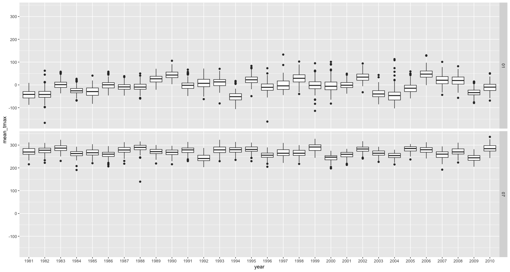

p8105_hw3_yl5839
================
Yuying Lu (yl5839)
2024-10-05

Load necessary packages and set options for plot.

``` r
library(tidyverse)
library(p8105.datasets)
options(
  ggplot2.continuous.colour = "viridis",
  ggplot2.continuous.fill = "viridis"
)
```

# Problem 1

### Data Importing

``` r
data("ny_noaa")
ny_noaa
```

    ## # A tibble: 2,595,176 × 7
    ##    id          date        prcp  snow  snwd tmax  tmin 
    ##    <chr>       <date>     <int> <int> <int> <chr> <chr>
    ##  1 US1NYAB0001 2007-11-01    NA    NA    NA <NA>  <NA> 
    ##  2 US1NYAB0001 2007-11-02    NA    NA    NA <NA>  <NA> 
    ##  3 US1NYAB0001 2007-11-03    NA    NA    NA <NA>  <NA> 
    ##  4 US1NYAB0001 2007-11-04    NA    NA    NA <NA>  <NA> 
    ##  5 US1NYAB0001 2007-11-05    NA    NA    NA <NA>  <NA> 
    ##  6 US1NYAB0001 2007-11-06    NA    NA    NA <NA>  <NA> 
    ##  7 US1NYAB0001 2007-11-07    NA    NA    NA <NA>  <NA> 
    ##  8 US1NYAB0001 2007-11-08    NA    NA    NA <NA>  <NA> 
    ##  9 US1NYAB0001 2007-11-09    NA    NA    NA <NA>  <NA> 
    ## 10 US1NYAB0001 2007-11-10    NA    NA    NA <NA>  <NA> 
    ## # ℹ 2,595,166 more rows

The dataset I load is strange.

# Problem 2

## Data Wrangling

``` r
covar_df = read_csv("data/nhanes_covar.csv",skip = 4) |> 
  janitor::clean_names() |>
  filter(age>=21) |> 
  drop_na() |> 
  mutate(sex = factor(case_match(sex,
                          1 ~ 'Male',
                          2 ~ 'Female')),
         education =factor(case_match(education,
                          1 ~ 'Low',
                          2 ~ 'Medium',
                          3 ~ 'High'), 
                          levels = c('Low', 'Medium', 'High'))) 

accel_df = read_csv("data/nhanes_accel.csv") |> 
  janitor::clean_names()

final_df = covar_df |> 
  left_join(accel_df, by = 'seqn')

head(final_df,5)
```

    ## # A tibble: 5 × 1,445
    ##    seqn sex      age   bmi education  min1  min2  min3  min4  min5  min6  min7
    ##   <dbl> <fct>  <dbl> <dbl> <fct>     <dbl> <dbl> <dbl> <dbl> <dbl> <dbl> <dbl>
    ## 1 62161 Male      22  23.3 Medium     1.11  3.12  1.47 0.938  1.60 0.145 2.10 
    ## 2 62164 Female    44  23.2 High       1.92  1.67  2.38 0.935  2.59 5.22  2.39 
    ## 3 62169 Male      21  20.1 Medium     5.85  5.18  4.76 6.48   6.85 7.24  6.12 
    ## 4 62174 Male      80  33.9 High       5.42  3.48  3.72 3.81   6.85 4.45  0.561
    ## 5 62177 Male      51  20.1 Medium     6.14  8.06  9.99 6.60   4.57 2.78  7.10 
    ## # ℹ 1,433 more variables: min8 <dbl>, min9 <dbl>, min10 <dbl>, min11 <dbl>,
    ## #   min12 <dbl>, min13 <dbl>, min14 <dbl>, min15 <dbl>, min16 <dbl>,
    ## #   min17 <dbl>, min18 <dbl>, min19 <dbl>, min20 <dbl>, min21 <dbl>,
    ## #   min22 <dbl>, min23 <dbl>, min24 <dbl>, min25 <dbl>, min26 <dbl>,
    ## #   min27 <dbl>, min28 <dbl>, min29 <dbl>, min30 <dbl>, min31 <dbl>,
    ## #   min32 <dbl>, min33 <dbl>, min34 <dbl>, min35 <dbl>, min36 <dbl>,
    ## #   min37 <dbl>, min38 <dbl>, min39 <dbl>, min40 <dbl>, min41 <dbl>, …

I first load the demographic data and clean the column names. Then I
exclude the participents less than 21 years of age by `filter()` and
drop those with missing demographic data using `drop_na()`. After that,
I load and clean name of the accelerometer data and merge that with
demographic data. Finally, I turn the nonnumeric variable in column
`seqn`, `sex` and `education` into factors.

- `seqn`: the identity of each participant
- `sex`: match 1 ~ ‘Male’ and 2 ~ ‘Female’
- `education`:
  - match 1 ~ ‘Low’, meaning less than high school
  - match 2 ~ ‘Medium’, meaning high school equivalent
  - match 1 ~ ‘High’, meaning more than high school.

The final data includes 228 participants and the total 1445 columns
record their seqn, sex, age, bmi, education and MIMS values for 1440
minutes of a 24-hour day starting at midnight.

## Data Summary

### Table for sex v.s. education

Here is the reader-friendly table for number of men and women in each
education category

``` r
final_df |> 
  group_by(sex, education) |> 
  summarize(count = n()) |> 
  pivot_wider(names_from = sex, values_from = count) |> 
  knitr::kable()
```

| education | Female | Male |
|:----------|-------:|-----:|
| Low       |     28 |   27 |
| Medium    |     23 |   35 |
| High      |     59 |   56 |

**Comment:** The ratio of male and female in low or high education
category are nearly 1:1, and it increases to about 7:5 in medium
education.

### Plot of age dendity

The following plot shows the age distributions for men and women in each
education category.

``` r
final_df |> 
  ggplot(aes(x=age, color = sex, fill = sex))+
  geom_density(alpha = .5)+
  scale_color_brewer(type = 'qual')+
  scale_fill_brewer(type = 'qual')+
  facet_grid(~education)
```

<!-- -->
**Comment:**

- In low education category, the age distributions in male and female
  are similar. The elder people take a large proportion.
- In medium education category, people older than 60 take a large
  proportion in female but the people younger than 40 take a large
  proportion in male.
- In high education category, the density of people under 40 is larger
  than that in male.

## Data Analysis

### Plot of Total Activities

Here is the scatter plot with the smooth trend of total activities of
men and women in different education category.

``` r
final_df |> 
  mutate(total_act = rowMeans(final_df[6:ncol(final_df)])) |> 
  ggplot(aes(x=age, y= total_act, fill = sex, color = sex))+
  geom_point(alpha = .5)+
  geom_smooth(se= F)+
  scale_color_brewer(type = 'qual')+
  scale_fill_brewer(type = 'qual')+
  facet_grid(~education)
```

<!-- -->

**Comment:**

From here unfinished . Need to be done ()!!!

### Plot for 24-hour activity time

``` r
final_df |> pivot_longer(
  min1:min1440,
  names_to = 'min',
  names_prefix = 'min',
  values_to = 'act_time'
) |> 
  mutate(min = as.numeric(min)) |> 
  ggplot(aes(x=min, y= act_time, fill = sex, color = sex))+
  geom_point(alpha = .5, size= .3)+
  geom_smooth(se= F)+
  scale_color_brewer(type = 'qual')+
  scale_fill_brewer(type = 'qual')+
  facet_grid(education ~.)
```

<!-- -->

# Problem 3
