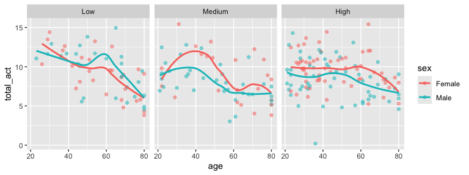

p8105_hw3_yl5839
================
Yuying Lu (yl5839)
2024-10-05

Load necessary packages and set options for plot.

``` r
library(tidyverse)
library(p8105.datasets)
options(
  ggplot2.continuous.colour = "viridis",
  ggplot2.continuous.fill = "viridis"
)
```

# Problem 1

## Data Importing and Cleaning

``` r
data("ny_noaa")
ny_noaa
```

    ## # A tibble: 2,595,176 × 7
    ##    id          date        prcp  snow  snwd tmax  tmin 
    ##    <chr>       <date>     <int> <int> <int> <chr> <chr>
    ##  1 US1NYAB0001 2007-11-01    NA    NA    NA <NA>  <NA> 
    ##  2 US1NYAB0001 2007-11-02    NA    NA    NA <NA>  <NA> 
    ##  3 US1NYAB0001 2007-11-03    NA    NA    NA <NA>  <NA> 
    ##  4 US1NYAB0001 2007-11-04    NA    NA    NA <NA>  <NA> 
    ##  5 US1NYAB0001 2007-11-05    NA    NA    NA <NA>  <NA> 
    ##  6 US1NYAB0001 2007-11-06    NA    NA    NA <NA>  <NA> 
    ##  7 US1NYAB0001 2007-11-07    NA    NA    NA <NA>  <NA> 
    ##  8 US1NYAB0001 2007-11-08    NA    NA    NA <NA>  <NA> 
    ##  9 US1NYAB0001 2007-11-09    NA    NA    NA <NA>  <NA> 
    ## 10 US1NYAB0001 2007-11-10    NA    NA    NA <NA>  <NA> 
    ## # ℹ 2,595,166 more rows

This dataset contains 2595176 rows and 7 columns, recording maximum and
minimum temperature, total daily precipitation, snowfall, and snow depth
in different satations each day. However, there is lots of missing
values in this data set, so we should drop the NA’s before we conduct
further data analysis.

``` r
data_df = 
  ny_noaa |> 
  drop_na() |> 
  janitor::clean_names() |> 
  mutate(year = format(date, "%Y"),
         month = format(date, "%m"),
         day = format(date, "%d"),
         tmax = as.numeric(tmax),
         tmin = as.numeric(tmin))
head(data_df,5)
```

    ## # A tibble: 5 × 10
    ##   id          date        prcp  snow  snwd  tmax  tmin year  month day  
    ##   <chr>       <date>     <int> <int> <int> <dbl> <dbl> <chr> <chr> <chr>
    ## 1 USC00300023 1981-01-03     0     0     0  -122  -206 1981  01    03   
    ## 2 USC00300023 1981-01-05     0     0     0   -56  -178 1981  01    05   
    ## 3 USC00300023 1981-01-12     0     0     0  -122  -306 1981  01    12   
    ## 4 USC00300023 1981-01-13     0     0     0   -67  -289 1981  01    13   
    ## 5 USC00300023 1981-01-15     0     0     0   -50  -106 1981  01    15

``` r
summary(data_df[,3:6])
```

    ##       prcp               snow               snwd              tmax       
    ##  Min.   :    0.00   Min.   : -13.000   Min.   :   0.00   Min.   :-389.0  
    ##  1st Qu.:    0.00   1st Qu.:   0.000   1st Qu.:   0.00   1st Qu.:  56.0  
    ##  Median :    0.00   Median :   0.000   Median :   0.00   Median : 161.0  
    ##  Mean   :   30.08   Mean   :   4.649   Mean   :  36.66   Mean   : 146.5  
    ##  3rd Qu.:   23.00   3rd Qu.:   0.000   3rd Qu.:   0.00   3rd Qu.: 239.0  
    ##  Max.   :20325.00   Max.   :7765.000   Max.   :9195.00   Max.   : 444.0

Notice that there is negative number for snowfall, thus we further
filter the data to ensure that all the rows contain reasonable value in
each unit.

### Data Filtering

``` r
data_df = data_df |> filter(snow>=0)
summary(data_df[,3:6])
```

    ##       prcp               snow               snwd              tmax       
    ##  Min.   :    0.00   Min.   :   0.000   Min.   :   0.00   Min.   :-389.0  
    ##  1st Qu.:    0.00   1st Qu.:   0.000   1st Qu.:   0.00   1st Qu.:  56.0  
    ##  Median :    0.00   Median :   0.000   Median :   0.00   Median : 161.0  
    ##  Mean   :   30.08   Mean   :   4.649   Mean   :  36.66   Mean   : 146.5  
    ##  3rd Qu.:   23.00   3rd Qu.:   0.000   3rd Qu.:   0.00   3rd Qu.: 239.0  
    ##  Max.   :20325.00   Max.   :7765.000   Max.   :9195.00   Max.   : 444.0

From the summary of the filtered data, we can see the 3rd quantile of
the snowfall is 0, which implies 0 is the most commonly observed values.

## Two-panel Plot

### Average max temperature

``` r
data_df |> 
  filter(month %in% c('01', '07')) |> 
  group_by(id,year,month) |> 
  summarise(mean_tmax=mean(tmax)) |> 
  ggplot(aes(x = year, y = mean_tmax)) + 
  geom_boxplot()+
  facet_grid(month~.)
```

<!-- -->
**Comment:** Generally, the average max temperature in July in each
station across years is higher that that in January. Additionally,
according to the box-plot, there are outliers of the average max
temperature in January and in July in most of the years.

### `tmax` vs `tmin`

``` r
data_df |> 
  pivot_longer(
    tmax:tmin,
    values_to = 'temp',
    names_to = 'type'
  ) |> 
  ggplot(aes(x = month, y = temp)) + 
  geom_boxplot()+
  facet_grid(~type)
```

<!-- -->

**Comment:** I plot the box plot for `tmax` and `tmin` by month.
According to the figure, the distibution of tmax and tmin have similar
pattern within a year.

### distribution of snowfall seperately by year

``` r
data_df |> 
  filter((snow > 0) & (snow < 100)) |>  
  ggplot(aes(x = snow)) + 
  geom_density()+
  facet_wrap(~year, ncol= 6)
```

<!-- -->

**Comment:** The distribution of the snowfall in each year has similar
pattern. The snow values between 1-25 have higher density than the
values larger than 25. Additionally, there are spikes at value 50 and 75
in the density distribution of the snowfall in each year.

# Problem 2

## Data Wrangling

``` r
covar_df = read_csv("data/nhanes_covar.csv",skip = 4) |> 
  janitor::clean_names() |>
  filter(age>=21) |> 
  drop_na() |> 
  mutate(sex = factor(case_match(sex,
                          1 ~ 'Male',
                          2 ~ 'Female')),
         education =factor(case_match(education,
                          1 ~ 'Low',
                          2 ~ 'Medium',
                          3 ~ 'High'), 
                          levels = c('Low', 'Medium', 'High'))) 

accel_df = read_csv("data/nhanes_accel.csv") |> 
  janitor::clean_names()

final_df = covar_df |> 
  left_join(accel_df, by = 'seqn')

head(final_df,5)
```

    ## # A tibble: 5 × 1,445
    ##    seqn sex      age   bmi education  min1  min2  min3  min4  min5  min6  min7
    ##   <dbl> <fct>  <dbl> <dbl> <fct>     <dbl> <dbl> <dbl> <dbl> <dbl> <dbl> <dbl>
    ## 1 62161 Male      22  23.3 Medium     1.11  3.12  1.47 0.938  1.60 0.145 2.10 
    ## 2 62164 Female    44  23.2 High       1.92  1.67  2.38 0.935  2.59 5.22  2.39 
    ## 3 62169 Male      21  20.1 Medium     5.85  5.18  4.76 6.48   6.85 7.24  6.12 
    ## 4 62174 Male      80  33.9 High       5.42  3.48  3.72 3.81   6.85 4.45  0.561
    ## 5 62177 Male      51  20.1 Medium     6.14  8.06  9.99 6.60   4.57 2.78  7.10 
    ## # ℹ 1,433 more variables: min8 <dbl>, min9 <dbl>, min10 <dbl>, min11 <dbl>,
    ## #   min12 <dbl>, min13 <dbl>, min14 <dbl>, min15 <dbl>, min16 <dbl>,
    ## #   min17 <dbl>, min18 <dbl>, min19 <dbl>, min20 <dbl>, min21 <dbl>,
    ## #   min22 <dbl>, min23 <dbl>, min24 <dbl>, min25 <dbl>, min26 <dbl>,
    ## #   min27 <dbl>, min28 <dbl>, min29 <dbl>, min30 <dbl>, min31 <dbl>,
    ## #   min32 <dbl>, min33 <dbl>, min34 <dbl>, min35 <dbl>, min36 <dbl>,
    ## #   min37 <dbl>, min38 <dbl>, min39 <dbl>, min40 <dbl>, min41 <dbl>, …

I first load the demographic data and clean the column names. Then I
exclude the participents less than 21 years of age by `filter()` and
drop those with missing demographic data using `drop_na()`. After that,
I load and clean name of the accelerometer data and merge that with
demographic data. Finally, I turn the nonnumeric variable in column
`seqn`, `sex` and `education` into factors.

- `seqn`: the identity of each participant.
- `sex`: match 1 ~ ‘Male’ and 2 ~ ‘Female’.
- `education`:
  - match 1 ~ ‘Low’, meaning less than high school;
  - match 2 ~ ‘Medium’, meaning high school equivalent;
  - match 1 ~ ‘High’, meaning more than high school.

The final data includes 228 participants and the total 1445 columns
record their seqn, sex, age, bmi, education and MIMS values for 1440
minutes of a 24-hour day starting at midnight.

## Data Summary

### Table for sex v.s. education

Here is the reader-friendly table for number of men and women in each
education category.

``` r
final_df |> 
  group_by(sex, education) |> 
  summarize(count = n()) |> 
  pivot_wider(names_from = sex, values_from = count) |> 
  knitr::kable()
```

| education | Female | Male |
|:----------|-------:|-----:|
| Low       |     28 |   27 |
| Medium    |     23 |   35 |
| High      |     59 |   56 |

**Comment:** The ratio of male and female in low or high education
category are nearly 1:1, and it increases to about 7:5 in medium
education.

### Plot of age density

The following plot shows the age distributions for men and women in each
education category.

``` r
final_df |> 
  ggplot(aes(x=age, color = sex, fill = sex))+
  geom_density(alpha = .5)+
  facet_grid(~education)
```

<!-- -->
**Comment:**

- In low education category, the age distributions in male and female
  are similar. The elder people take a large proportion.
- In medium education category, people older than 60 take a large
  proportion in female but the people younger than 40 take a large
  proportion in male.
- In high education category, the density of people under 40 is larger
  than that in male.

## Data Analysis

### Plot of total activities

Here is the scatter plot with the smooth trend of total activities of
men and women in different education category.

``` r
final_df |> 
  mutate(total_act = rowMeans(final_df[6:ncol(final_df)])) |> 
  ggplot(aes(x=age, y= total_act, fill = sex, color = sex))+
  geom_point(alpha = .5)+
  geom_smooth(se= F)+
  facet_grid(~education)
```

<!-- -->

**Comment:**

- In low education category, the average of total activity value of
  women under 40 is higher than that of men in the same age. However,
  the average of total activity value of women over 40 is lower than
  that of men in the same age. Additionally, the younger ones have
  significant more activities than the older ones.
- In medium education category, the average of total activity value of
  women is higher than that of men in the same age except the group
  under 25, where men have higher values than the same age women.
  Besides, the people at around 40 years old have the highest total
  activity values while people over 60 years old generally have the
  total activity values.
- In high education category, the average of total activity value of
  women is higher than that of men in the same age. And there’s only a
  little decrease in the total activity values among the old ones than
  that among the younger ones.

### Plot for 24-hour activity time

I divide the MIMS values in to 24 hours category and make the box plot
of the mean value among different sex and education level.

``` r
final_df |> pivot_longer(
  min1:min1440,
  names_to = 'min',
  names_prefix = 'min',
  values_to = 'act_time'
) |> 
  mutate(min = as.numeric(min),
         hour = factor(paste0(ceiling(min/60)-1,'-',(ceiling(min/60))%%24,'h')),
         hour = forcats::fct_reorder(hour, min, median)) |>
  ggplot(aes(x=hour, y= act_time, fill = sex, color = sex))+
  geom_boxplot(alpha=.5, position = 'dodge',outlier.size=.5)+
  geom_smooth(se= F)+
  facet_grid(education~.)+
  theme(axis.text.x = element_text(angle = 45, hjust = 1))
```

<!-- -->

**Comment:**

- In low education category, there isn’t much different between women
  and men in different time slot within a 24-hour day. However, men have
  slightly higher mean MIMS values than women from 8pm to 8am the next
  day.
- In medium education category, the mean MIMS value doesn’t vary much
  between different sex.
- In high education category, women have higher mean MIMS values than
  men in the day (from 7am to 8pm), while in the other time, there isn’t
  much significant difference between people of different sex.

Gernally speaking, comparing people of different sex at the same time
period of the day, I find men have higher mean MIMS value around the
midnight while women have higher mean MIMS value in the day. This
applies to all the three education category. Besides, people generally
have high MINS value in the day time and low value during the night.

# Problem 3

## Data Importing and Cleaning

``` r
jan2020_df = read_csv('data/citibike/Jan 2020 Citi.csv') |> 
  mutate(date = 'Jan2020')

july2020_df = read_csv('data/citibike/July 2020 Citi.csv') |> 
  mutate(date = 'July2020')

jan2024_df = read_csv('data/citibike/Jan 2024 Citi.csv') |> 
  mutate(date = 'Jan2024')

july2024_df = read_csv('data/citibike/July 2024 Citi.csv') |> 
  mutate(date = 'July2024')

result_df = rbind(jan2020_df, july2020_df, jan2024_df, july2024_df) |>
  janitor::clean_names() |> 
  drop_na()

result_df 
```

    ## # A tibble: 99,253 × 8
    ##    ride_id   rideable_type weekdays duration start_station_name end_station_name
    ##    <chr>     <chr>         <chr>       <dbl> <chr>              <chr>           
    ##  1 4BE06CB3… classic_bike  Tuesday     15.3  Columbus Ave & W … E 53 St & Madis…
    ##  2 26886E03… classic_bike  Wednesd…     5.31 2 Ave & E 96 St    1 Ave & E 110 St
    ##  3 24DC5606… classic_bike  Friday       9.69 Columbia St & Riv… Grand St & Eliz…
    ##  4 EEDC1053… classic_bike  Sunday       7.00 W 84 St & Columbu… Columbus Ave & …
    ##  5 2CD4BD4C… classic_bike  Friday       2.85 Forsyth St & Broo… Suffolk St & St…
    ##  6 E18682F9… classic_bike  Sunday      25.5  Allen St & Hester… Atlantic Ave & …
    ##  7 B9B2E896… classic_bike  Sunday       3.65 Lafayette St & Je… Washington Pl &…
    ##  8 DEF8F504… classic_bike  Sunday      38.3  28 Ave & 44 St     Broadway & Kosc…
    ##  9 17D44DA9… classic_bike  Thursday    38.5  Barrow St & Hudso… Emerson Pl & My…
    ## 10 0FD113A3… classic_bike  Tuesday      6.52 Carlton Ave & Par… Emerson Pl & My…
    ## # ℹ 99,243 more rows
    ## # ℹ 2 more variables: member_casual <chr>, date <chr>

**Description:** There are datasets in four combinations of year and
month – Jan 2020, July 2020, Jan 2024 and July 2024. I combind these
four dataset and add a column `data` to distinguish the rides in
different months. After dropping the row that contains `NA` and cleaning
the column names, I get the resulting dataset with 99253 rows and 8
columns. Each row represents a ride and the columns record its ride ID,
rideable_type, which weekdays the ride occurred, duration, start and end
station, the rider’s identity (member or casual), and the year and month
data of that ride.

## Reader-friendly Table

### Showing total number of rides

``` r
result_df |> 
  group_by(date, member_casual) |> 
  mutate(date = factor(date, levels = c('Jan2020', 'July2020','Jan2024','July2024'))) |> 
  summarise(count=n()) |> 
  pivot_wider(names_from = member_casual, values_from = count) |> 
  knitr::kable()
```

| date     | casual | member |
|:---------|-------:|-------:|
| Jan2020  |    980 |  11418 |
| July2020 |   5625 |  15388 |
| Jan2024  |   2094 |  16705 |
| July2024 |  10843 |  36200 |

**Comment:**

- In the same year, the total number of rides is larger in July than
  that in Jan;
- In the same combination of the year and month, the total number of
  rides in member is larger than that in casual riders;
- The total number of rides is increasing with time goes by.

### Showing 5 most popular starting stations for July 2024

``` r
pop_stat = result_df |> 
  filter(date == 'July2024') |> 
  group_by(start_station_name) |> 
  summarise(number=n()) |> 
  arrange(desc(number)) 
  
knitr::kable(pop_stat[1:5,])
```

| start_station_name       | number |
|:-------------------------|-------:|
| Pier 61 at Chelsea Piers |    163 |
| University Pl & E 14 St  |    155 |
| W 21 St & 6 Ave          |    152 |
| West St & Chambers St    |    150 |
| W 31 St & 7 Ave          |    145 |

The most popular stations for July 2024 are Pier 61 at Chelsea Piers,
University Pl & E 14 St, W 21 St & 6 Ave, West St & Chambers St, W 31 St
& 7 Ave, with the total number of rides recorded in the column `number`
in the table.

## Plotting

### Effects of the day of the week, month and year

``` r
result_df |> 
  group_by(date, weekdays) |> 
  summarise(median_duration = median(duration)) |> 
  mutate(weekdays = factor(weekdays, levels = c('Sunday', 'Monday', 'Tuesday', 'Wednesday', 'Thursday', 'Friday', 'Saturday')),
         date = factor(date, levels = c('Jan2020', 'July2020','Jan2024','July2024'))) |> 
  ggplot(aes(x = weekdays, y = median_duration, color = date)) +
  geom_point(aes(shape = date), size = 2)
```

<!-- -->

**Comment:**

- The median ride duration are in same order which is July2020 \>
  July2024 \> Jan2020 \> Jan2024;
- Within the same year, the median ride duration in Jan is generally
  shorter than that in July.
- Within the same year and month expect Jan 2024, the duration of the
  median rides of weekends are longer (Sunday and Saturday) than that of
  weekdays.

### Impact of month, membership status, and bike type on the distribution of ride duration

``` r
result_df |> 
  filter(date %in% c('Jan2024', 'July2024')) |> 
  ggplot(aes(x= duration, fill = factor(member_casual),color = factor(member_casual)))+
  geom_density(alpha = .5)+
  facet_grid(date~rideable_type)
```

<!-- -->

**Comment:**

- Casual riders are more likely to have a longer ride duration than
  members do, especially when they’re using classic bike. Maybe it’s
  because when using the electric bikes, the gap between duration is
  reduced because of the higher speed of electric bike;
- The density of longer duration of classic bike is higher than that of
  electric one;
- The riding duration of electric bikes is increasing from Jan to July.
